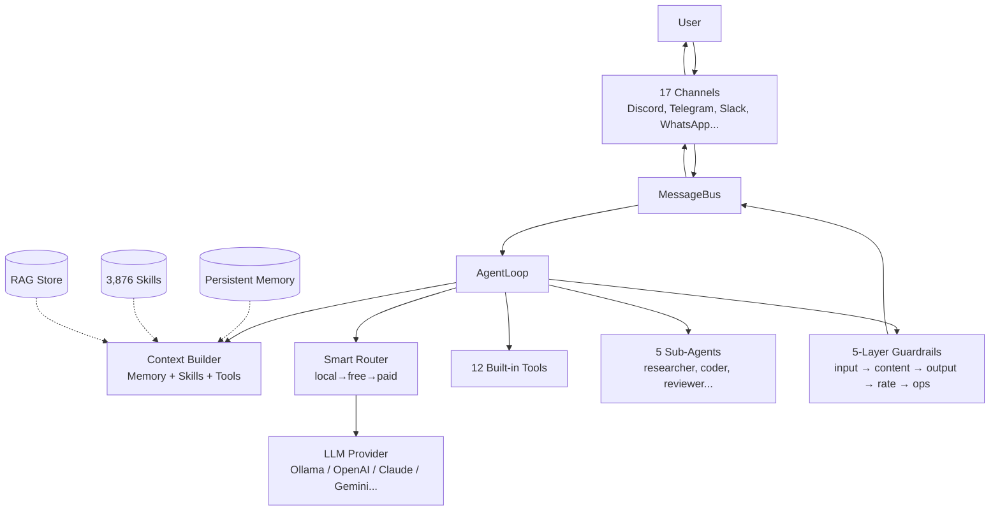

<h1 align="center">trio.ai</h1>

<p align="center">
  <strong>Train your own AI. Deploy it everywhere. Own it forever.</strong>
</p>

<p align="center">
  The open-source agent framework that lets you train custom LLMs and run them across <strong>17 chat platforms</strong> with <strong>3,876 built-in skills</strong>, <strong>12 tools</strong>, and a <strong>5-layer security guardrail</strong>.
</p>

<p align="center">
  <a href="https://github.com/iampopye/trio/stargazers"></a>
  <a href="https://github.com/iampopye/trio/blob/main/LICENSE"></a>
  <a href="https://www.python.org/"></a>
  <a href="https://github.com/iampopye/trio"></a>
  <a href="https://github.com/iampopye/trio/blob/main/SECURITY.md"></a>
  <a href="https://modelcontextprotocol.io/"></a>
</p>

<p align="center">
  <a href="#-quick-start">Quick Start</a> •
  <a href="#-model-tiers">Models</a> •
  <a href="#-skills">Skills</a> •
  <a href="#-channels">Channels</a> •
  <a href="#-commands">Commands</a> •
  <a href="#-architecture">Architecture</a> •
  <a href="#-comparison">Comparison</a>
</p>

---

## Why trio.ai

Most AI agent frameworks lock you into one provider, one platform, and someone else's model. **trio.ai is different.**

- **Train your own LLM** — built-in transformer training pipeline (nano to pro, 1M to 30B params)
- **Use any provider** — Ollama, OpenAI, Claude, Gemini, Groq, DeepSeek, OpenRouter, GitHub Models
- **Deploy anywhere** — 17 chat channels (Discord, Telegram, Slack, WhatsApp, Teams, SMS, Email, and more)
- **3,876 built-in skills** — coding, marketing, DevOps, security, finance, data science, legal, health, and more
- **5-layer guardrails** — input/output filtering, jailbreak detection, content safety, rate limiting
- **Smart routing** — automatically picks local first, free APIs next, paid only if you allow
- **MCP compatible** — works with Claude Code, Cursor, Zed, Continue, and any MCP client

> **Stop paying per-token. Stop trusting closed-source models. Stop being locked in.**

---

## ⚡ Quick Start

### Install

```bash
pip install trio-ai
trio onboard
```

That's it. `trio onboard` walks you through provider setup, model download, and channel configuration in under 2 minutes.

### Start chatting

```bash
trio agent
```

### Or use the web UI

```bash
trio serve
# Open http://localhost:28337
```

### From source

```bash
git clone https://github.com/iampopye/trio.git
cd trio
python install.py
trio onboard
```

> **New to AI agents?** Run `trio help` for a guided tour of every command.

---

## 🧠 Model Tiers

trio.ai ships with **6 built-in model tiers** you can train, download, or run locally via Ollama:

| Tier | Params | Size (Q4) | Hardware | Best For |
|------|--------|-----------|----------|----------|
| **trio-nano** | ~1M | 600 MB | CPU, 4 GB RAM | Embedded devices, IoT, testing |
| **trio-small** | ~125M | 1.2 GB | CPU/GPU, 8 GB RAM | Lightweight chat, edge deployment |
| **trio-medium** | ~350M | 2.5 GB | GPU/Apple Silicon | Personal assistant, coding helper |
| **trio-high** | ~750M | 5.0 GB | RTX 3060+, M2+ | Production workloads |
| **trio-max** | ~3B | 5.6 GB | RTX 4070+, M3+ | Enterprise tasks, complex reasoning |
| **trio-pro** | ~30B (MoE) | 18 GB | RTX 4090, A100 | Research, advanced agentic workflows |

### Switch models on the fly

```bash
# Set default model
trio provider set --model trio-max

# Or use any external provider
trio provider set --provider openai --model gpt-4o
trio provider set --provider anthropic --model claude-opus-4-6
trio provider set --provider gemini --model gemini-2.5-pro
trio provider set --provider ollama --model llama3.1:8b

# In-chat: switch with the /provider slash command
trio agent
> /provider                       # Open provider picker
> /model trio-max                 # Quick model switch
```

### Train your own

```bash
pip install trio-ai[model]
trio train --setup                 # Download pre-quantized models
trio train                          # Train from scratch (resume with Ctrl+C)
```

---

## 🎯 Skills

trio.ai includes **3,876 community-curated skills** across 13 categories. Skills are markdown files that teach the agent how to do specific tasks.

| Category | Count | Examples |
|----------|------:|----------|
| **General** | 415 | Email drafting, summarization, brainstorming |
| **Coding** | 418 | Debug Python, refactor JS, write SQL, code review |
| **SysAdmin** | 204 | Docker, K8s, Nginx, systemd, log analysis |
| **Productivity** | 167 | GTD workflows, meeting notes, task triage |
| **Marketing** | 163 | SEO, ad copy, social media, email campaigns |
| **Web Dev** | 159 | React, Next.js, Tailwind, deployment |
| **Data Science** | 102 | Pandas, scikit-learn, visualization, ML pipelines |
| **Security** | 80 | Pentest, OWASP, log analysis, hardening |
| **Creative** | 79 | Storytelling, copywriting, ideation |
| **Finance** | 47 | Bookkeeping, invoicing, P&L analysis |
| **Legal** | 29 | Contract review, NDA drafting, IP basics |
| **Education** | 25 | Tutoring, lesson plans, quiz generation |
| **Health** | 21 | Wellness, fitness plans, nutrition (informational) |

### Browse and install skills

```bash
trio skill list                          # Show installed skills
trio hub search "python"                 # Search the community registry
trio hub trending                         # Most popular skills
trio skill install python_debugger        # Install a specific skill
trio skill install codex_review devops_toolkit  # Install multiple
trio skill remove python_debugger        # Remove a skill
```

### Create your own skill

```bash
mkdir -p ~/.trio/skills
cat > ~/.trio/skills/my_skill.md <<EOF
---
name: my_skill
description: What this skill does
tags: [coding, python]
---

# Instructions
When the user asks about X, do Y by following these steps...
EOF
```

trio.ai picks up new skills automatically — no restart needed.

---

## 📡 Channels

Deploy your AI on any messaging platform:

| Channel | Type | Setup |
|---------|------|-------|
| **CLI** | Terminal | Built-in |
| **Web UI** | Browser | `trio serve` |
| **Discord** | Bot | Bot token |
| **Telegram** | Bot | Bot token |
| **Slack** | Workspace bot | Socket Mode tokens |
| **WhatsApp** | Business API | Meta tokens + webhook |
| **Microsoft Teams** | Bot Framework | App ID + password |
| **Google Chat** | Service account | Service account JSON |
| **Signal** | Private messenger | Phone number |
| **Matrix / Element** | Federated chat | Homeserver + token |
| **iMessage** | macOS only | AppleScript |
| **SMS** | Twilio | Account SID + token |
| **Instagram DM** | Meta Graph API | Access token |
| **Facebook Messenger** | Page bot | Page access token |
| **LINE** | LINE Bot SDK | Channel token + secret |
| **Reddit** | Bot | Client credentials |
| **Email** | IMAP / SMTP | Username + password |

### Enable channels

```bash
trio onboard                              # Interactive channel setup
trio gateway                              # Start all enabled channels
trio daemon install                       # Auto-start as system service
trio daemon status                        # Check daemon health
```

---

## 🛠 Tools

trio.ai includes **12 built-in tools** that the agent can use autonomously:

| Tool | Description |
|------|-------------|
| `web_search` | DuckDuckGo / Firecrawl web search |
| `browser` | Playwright browser automation (navigate, click, screenshot) |
| `shell` | Sandboxed shell execution (allowlist-based) |
| `file_ops` | Read, write, append, list files (workspace-restricted) |
| `email` | Send/receive via SMTP/IMAP |
| `calendar` | Schedule and manage events |
| `notes` | Persistent note-taking |
| `screenshot` | Capture screen regions |
| `rag_search` | Semantic search over local documents |
| `math_solver` | Symbolic math via SymPy |
| `delegate` | Spawn sub-agents for complex tasks |
| `mcp_client` | Connect to any MCP server (code-review-graph, etc.) |

---

## 🤝 Sub-Agents

trio.ai delegates complex tasks to specialized sub-agents:

| Agent | Role | Tools |
|-------|------|-------|
| **researcher** | Web search, browsing, RAG synthesis | web_search, browser, rag_search |
| **coder** | Write, run, and debug code | shell, file_ops |
| **reviewer** | Code review, bug detection | read-only |
| **planner** | Task breakdown, architecture design | LLM-only |
| **summarizer** | Condense long documents | LLM-only |

Each sub-agent can use a **different model** for cost optimization (e.g., DeepSeek for research, Claude for coding).

---

## 📋 Commands

### Get help anytime

```bash
trio help                                 # Show all commands with examples
trio help <command>                       # Detailed help for a command
trio --version                            # Show version info
```

### Common commands

```bash
# Setup
trio onboard                              # Interactive setup wizard
trio doctor                               # Diagnose system issues
trio doctor --fix                         # Auto-repair common issues
trio status                               # System overview

# Chat
trio agent                                # Interactive chat
trio agent -m "summarize this PR"         # Single message
trio serve                                # Browser UI on port 28337

# Models & Providers
trio provider list                        # Show configured providers
trio provider add                         # Add a new LLM provider
trio provider set --model trio-max        # Set default model

# Skills
trio skill list                           # Installed skills
trio skill install <name>                 # Install from TrioHub
trio hub search "<query>"                 # Search 3,876 skills
trio hub trending                         # Popular skills

# Plugins
trio plugin list                          # Installed plugins
trio plugin install <path>                # Install a plugin
trio plugin enable <name>                 # Enable a plugin

# Channels
trio gateway                              # Start all enabled channels
trio daemon install                       # Auto-start on boot
trio daemon start | stop | restart        # Control the daemon

# Training
trio train --setup                        # Download pre-trained models
trio train                                # Train from scratch
trio train --reset                        # Restart training

# Maintenance
trio update                               # Self-update
trio pairing list                         # DM access management
```

📖 **Full command reference: [COMMANDS.md](COMMANDS.md)**

---

## 🏗 Architecture



### How a message flows

1. **User** sends a message via any channel (Discord, CLI, etc.)
2. **Channel adapter** normalizes it into an `InboundMessage`
3. **MessageBus** routes it to the **AgentLoop**
4. **Input guardrails** check for jailbreaks, prompt injection, harmful content
5. **Context builder** assembles system prompt + memory + relevant skills
6. **Smart router** picks the cheapest available provider
7. **LLM** generates a response, optionally calling tools
8. **Tool loop** executes any tool calls (max 20 iterations) and feeds results back
9. **Sub-agents** handle specialized subtasks if delegated
10. **Output guardrails** redact sensitive info before sending
11. **Channel adapter** delivers the response back to the user

---

## 🆚 Comparison

| Feature | trio.ai | Claude Code | OpenClaude | LangChain |
|---------|:-------:|:-----------:|:----------:|:---------:|
| Train your own LLM | ✅ | ❌ | ❌ | ❌ |
| 17 chat channels | ✅ | ❌ | ❌ | ⚠️ |
| Built-in skills (3,876+) | ✅ | ❌ | ❌ | ❌ |
| Multi-provider | ✅ | ❌ | ✅ | ✅ |
| Local-first routing | ✅ | ❌ | ⚠️ | ❌ |
| Sub-agents | ✅ | ✅ | ✅ | ⚠️ |
| 5-layer guardrails | ✅ | ⚠️ | ❌ | ❌ |
| MCP support | ✅ | ✅ | ✅ | ⚠️ |
| Plugin system | ✅ | ✅ | ⚠️ | ⚠️ |
| Production daemon | ✅ | ❌ | ❌ | ❌ |
| Web UI | ✅ | ✅ | ❌ | ❌ |
| 100% open source | ✅ | ❌ | ✅ | ✅ |
| One-command install | ✅ | ✅ | ✅ | ❌ |

---

## 🛡 Security

trio.ai implements a **7-layer defense model**:

1. **API key authentication** for the web API (auto-generated, machine-local)
2. **AES-128 encrypted secrets** in `~/.trio/config.json` (Fernet)
3. **Allowlist-based shell sandbox** (~70 safe commands, blocks shell interpreters)
4. **Plugin checksum verification** (SHA-256, refuses tampered plugins)
5. **5-layer LLM guardrails** (input filtering, output redaction, content safety, rate limiting, operational limits)
6. **File upload validation** (extension allowlist, 50MB cap, path traversal prevention)
7. **Per-IP rate limiting** on all API endpoints (60 req/min)

📖 **Full security policy: [SECURITY.md](SECURITY.md)**

---

## 🌐 Platform Support

| Platform | Status | Notes |
|----------|:------:|-------|
| Windows 10/11 | ✅ | NVIDIA CUDA, native installer |
| macOS Apple Silicon | ✅ | MPS Metal acceleration |
| macOS Intel | ✅ | CPU + optional eGPU |
| Ubuntu / Debian | ✅ | CUDA, ROCm |
| Fedora / Arch | ✅ | Full support |
| WSL2 | ✅ | CUDA passthrough |
| Android | ⚠️ | Termux experimental |
| iOS | ❌ | Not supported |

---

## 📂 Project Structure

```
trio/
├── trio/                       # Agent framework
│   ├── core/                   #   Loop, Bus, Config, Memory, Sessions, Router
│   ├── providers/              #   13+ LLM provider integrations
│   ├── channels/               #   17 chat channel adapters
│   ├── tools/                  #   12 built-in tools
│   ├── skills/                 #   3,876 markdown-based skills
│   ├── plugins/                #   Plugin system
│   ├── hub/                    #   TrioHub registry client
│   ├── shared/                 #   Guardrails, pairing, security
│   ├── cli/                    #   13 CLI commands
│   └── web/                    #   Browser UI (aiohttp)
├── trio_model/                 # LLM training engine
│   ├── model/                  #   Transformer (RoPE, GQA, RMSNorm, SwiGLU)
│   ├── training/               #   Pre-train, SFT, Constitutional AI
│   └── inference/              #   FastAPI inference server
├── triohub/                    # Community skill/plugin registry
├── COMMANDS.md                 # Full command reference
├── INSTALL.md                  # Platform-specific install guides
├── BENCHMARKS.md               # Performance & cost comparisons
├── SECURITY.md                 # Security policy
└── NOTICE                      # Third-party attributions
```

---

## 🤝 Contributing

trio.ai is open source and contributions are welcome. Before submitting a PR:

1. Read [CONTRIBUTING.md](CONTRIBUTING.md)
2. Sign the CLA on your first PR (handled automatically by the bot)
3. Run `trio doctor` to ensure your environment is set up
4. Follow the existing code style

---

## 📬 Community & Support

- **Issues**: [github.com/iampopye/trio/issues](https://github.com/iampopye/trio/issues)
- **Discussions**: [github.com/iampopye/trio/discussions](https://github.com/iampopye/trio/discussions)
- **Security**: See [SECURITY.md](SECURITY.md) for responsible disclosure

---

## 📜 License

trio.ai is released under the **MIT License**. See [LICENSE](LICENSE) for details.

**Copyright © 2026 Karan Garg.** All rights reserved.

> trio.ai is open source and free to use, modify, and distribute. The trio.ai name and brand are owned by Karan Garg.

---

<p align="center">
  <strong>Built from scratch. Train it. Deploy it. Own it.</strong>
</p>

<p align="center">
  <a href="https://github.com/iampopye/trio">⭐ Star us on GitHub</a> if trio.ai helps you build smarter agents.
</p>
